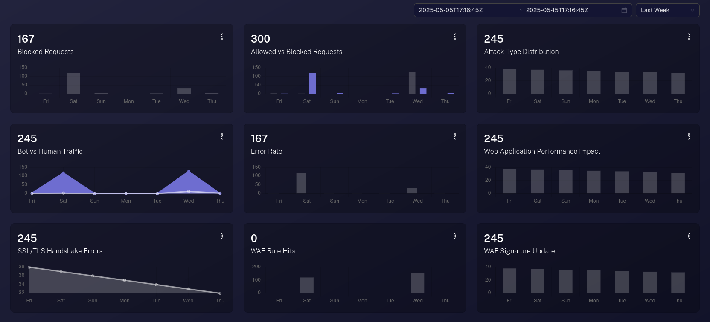

<picture>
  <source media="(prefers-color-scheme: dark)" srcset="https://zapisec.ai/wp-content/uploads/2023/09/Logo-ZAPISEC-removebg-preview-e1743969524490.png">
  <source media="(prefers-color-scheme: light)" srcset="https://zapisec.ai/wp-content/uploads/2023/09/Logo-ZAPISEC-removebg-preview-e1743969524490.png">
  
</picture>

# 🔐 ZAPISEC: AI-Application Firewall & API Security Monitoring Platform

Welcome to the official GitHub community for ZAPISEC – a next-generation, SaaS-based Web Application Firewall (WAF) and DNS Security Platform from **Cyberultron Consulting Private Limited**. ZAPISEC empowers organizations with robust protection against modern cyber threats, offering:

🛡️ Application Firewall(AI Based 7000+ Rules Based Detection)

🌐 DDoS Mitigation (Layer 3, Layer 4, and Layer 7)

🤖 Bot Protection

📊 Anomaly Detection using AI

Built for developers, DevSecOps, security engineers, and system administrators, ZAPISEC combines enterprise-grade security with community-driven innovation.

---

## 💡 About Zapisec

**ZAPISEC** is purpose-built to secure web applications, APIs, and DNS infrastructure against today’s most sophisticated threats. From the OWASP Top 10 vulnerabilities to malicious bot traffic, volumetric DDoS attacks, and AI-detected anomalies, ZAPISEC consolidates advanced security capabilities into a single, intuitive platform.

**🔥 Key Security Modules:**

**Application Firewall:**
Defend against injection attacks, XSS, and zero-day exploits with a customizable WAF that enforces strict rulesets and behavior-based anomaly detection.

**Bot Protection:**
Identify and control both good and bad bots using advanced fingerprinting, behavioral analysis, and dynamic bot score-based actions. Allow search engine crawlers while blocking credential stuffers, scrapers, and automation scripts.

**DDoS Management:**
Mitigate Layer 3, 4, and 7 distributed denial-of-service attacks with real-time traffic analysis, rate limiting, IP reputation intelligence, and geo-fencing.

**Anomaly Detection:**
Leverage AI-powered detection engines to identify unusual patterns, suspicious API usage, or traffic behavior anomalies—ensuring proactive threat mitigation.

🧩 Control & Visibility

ZAPISEC gives your security team granular control over:

Firewall rule customization via intuitive rule builders

Real-time traffic visualization and spike alerts

Rate limiting, geo-blocking, and session control

API and DNS protection with protocol-aware defenses

With a central dashboard that integrates all features, ZAPISEC simplifies the management of complex security workflows—making enterprise-grade protection accessible and manageable.

---

## 🚀 Key Features

### 1. 🔥 Application Firewall (WAF)
- **Custom Rules**: Define and deploy domain-specific security rules using various attributes (IP, country, path, method, etc.).
- **Managed Rules**: Predefined set of 48 WAF rules to block common attack vectors, with an option to extend and tailor to your needs.
- **Rate Limiting**: Throttle incoming requests based on thresholds to mitigate brute-force, scraping, or abuse attempts per domain.

<picture>
  <source media="(prefers-color-scheme: dark)" srcset="./others/application_firewall.png">
  <source media="(prefers-color-scheme: light)" srcset="./others/application_firewall.png">
  
</picture>

### 2. 🤖 Bot Protection
- **Good Bots**: Automatically allows verified bots from search engines (Google, Bing), social networks (X, Facebook), and cloud providers (AWS, Azure).
- **Bad Bots**: Detects and blocks harmful bots like content scrapers, credential stuffers, botnets, and impersonators using behavioral and signature-based techniques.

### 3. 📈 Anomaly Detection
- Real-time detection of traffic anomalies such as request spikes, pattern deviation, and behavioral oddities. The system analyzes root causes and tags anomalies for investigation.

### 4. 🛡️ DDoS Protection
- Defends against L3-L7 DDoS attacks using smart rule logic and filtering.
- Block or challenge requests based on:
  - IP Address or Range
  - Geographic Location (Country)
  - ASN (Autonomous System Number)
  - HTTP Method, Path, Host
  - Headers, Cookies, and User Agent

### 5. 🌐 DNS Management
- DNS configuration, record management, and propagation monitoring all in one panel.
- Seamless integration with firewall rules for unified security management.

---

## 🧩 Use Cases
- Secure your SaaS or eCommerce platform from automated threats
- Protect APIs from abuse or credential stuffing attacks
- Enable selective bot access for indexing and social engagement
- Monitor and mitigate high-traffic anomalies in real-time
- Manage DNS and firewall rules for multi-domain infrastructure

---
# ZAPISEC - Application Firewall Rules Matrix

Below is a comprehensive comparison of feature availability across different ZAPISEC editions.

| Firewall Rule Group                                                                 | Community | Basic | Premium | Enterprise |
|--------------------------------------------------------------------------------------|:---------:|:-----:|:-------:|:----------:|
| Core Fraud Prevention Framework for Account Creation                                 | ✅        | ✅    | ✅      | ✅         |
| Bot Detection & Blocking Core Rules                                                  | ✅        | ✅    | ✅      | ✅         |
| Account Take Over Prevention Core Rule                                               | ✅        | ✅    | ✅      | ✅         |
| Common Weak Enumeration & CVE Prevention Core Rule Group                             | ✅        | ✅    | ✅      | ✅         |
| Admin Protection Managed Prevention Core Rule Group                                  | ✅        | ✅    | ✅      | ✅         |
| Known Bad Inputs Managed Prevention Core Rule Group                                  | ✅        | ✅    | ✅      | ✅         |
| Linux/Unix Operation Systems Managed Prevention Core Rule Group                      | ✅        | ✅    | ✅      | ✅         |
| Windows Operation Systems Managed Prevention Core Rule Group                         | ✅        | ✅    | ✅      | ✅         |
| IP Reputation/Malicious IP’s Managed Prevention Core Rule Group                      | ✅        | ✅    | ✅      | ✅         |
| Sensitive Files and Folders Managed Prevention Core Rule Group                       | ✅        | ✅    | ✅      | ✅         |
| Outdated Browsers Managed Prevention Core Rule Group                                 | ❌        | ✅    | ✅      | ✅         |
| Backup Files Managed Prevention Core Rule Group                                      | ❌        | ✅    | ✅      | ✅         |
| HTTP Protocol Violation Managed Prevention Core Rule Group                           | ❌        | ✅    | ✅      | ✅         |
| LLM Based Injection/AI Based Injection Prevention Core Rule Group                    | ❌        | ✅    | ✅      | ✅         |
| Prompt Based Injection Prevention Core Rule Group                                    | ❌        | ✅    | ✅      | ✅         |
| Credential Stuffing Prevention Core Rule Group                                       | ❌        | ✅    | ✅      | ✅         |
| Malware and Virus Prevention Group Core Rule Group                                   | ❌        | ✅    | ✅      | ✅         |
| API Abuse Prevention Core Rule Group                                                 | ❌        | ✅    | ✅      | ✅         |
| Zero-Day Exploit Protection Core Rule Group                                          | ❌        | ✅    | ✅      | ✅         |
| Device Fingerprinting Core Rule Group                                                | ❌        | ❌    | ✅      | ✅         |
| Geolocation and IP Reputation Core Rule Group                                        | ❌        | ❌    | ✅      | ✅         |
| Web Shell Detection Core Rule Group                                                  | ❌        | ❌    | ✅      | ✅         |
| Content Security Group Core Rule Group                                               | ❌        | ❌    | ✅      | ✅         |
| Phishing Prevention Core Rule Group                                                  | ❌        | ❌    | ✅      | ✅         |
| Laravel PHP Framework Core Rule Group                                                | ❌        | ❌    | ✅      | ✅         |
| Spring Boot Framework Core Rule Group                                                | ❌        | ❌    | ✅      | ✅         |
| Wordpress Framework Core Rule Group                                                  | ❌        | ❌    | ✅      | ✅         |
| Drupal Framework Core Rule Group                                                     | ❌        | ❌    | ✅      | ✅         |
| Joomla Framework Core Rule Group                                                     | ❌        | ❌    | ✅      | ✅         |
| Magento Framework Core Rule Group                                                    | ❌        | ❌    | ❌      | ✅         |
| Express Node Framework Core Rule Group                                               | ❌        | ❌    | ❌      | ✅         |
| Flask Python Framework Core Rule Group                                               | ❌        | ❌    | ❌      | ✅         |
| SQL Injection Prevention Core Rule Group                                             | ❌        | ❌    | ❌      | ✅         |
| XSS Injection Prevention Core Rule Group                                             | ❌        | ❌    | ❌      | ✅         |
| Command Injection Prevention Core Rule Group                                         | ❌        | ❌    | ❌      | ✅         |
| Open Redirect Prevention Core Rule Group                                             | ❌        | ❌    | ❌      | ✅         |
| XXE Injection Prevention Core Rule Group                                             | ❌        | ❌    | ❌      | ✅         |
| RFI-LFI Injection Prevention Core Rule Group                                         | ❌        | ❌    | ❌      | ✅         |
| ASP.NET Language Prevention Core Rule Group                                          | ❌        | ❌    | ❌      | ✅         |
| Known REST API Exploits Prevention Core Rule Group                                   | ❌        | ❌    | ❌      | ✅         |
| Known GRAPHQL API Exploits Prevention Core Rule Group                                | ❌        | ❌    | ❌      | ✅         |
| Spring MVC Prevention Core Rule Group                                                | ❌        | ❌    | ❌      | ✅         |
| CakePHP Prevention Core Rule Group                                                   | ❌        | ❌    | ❌      | ✅         |
| Kubernetes API Prevention Core Rule Group                                            | ❌        | ❌    | ❌      | ✅         |
| Docker API Prevention Core Rule Group                                                | ❌        | ❌    | ❌      | ✅         |
| AWS API’s Prevention Core Rule Group                                                 | ❌        | ❌    | ❌      | ✅         |
| Azure API’s Prevention Core Rule Group                                               | ❌        | ❌    | ❌      | ✅         |
| GCP API’s Prevention Core Rule Group                                                 | ❌        | ❌    | ❌      | ✅         |

## 🧩 Access Rights
- <a href="https://zapisec.ai/pricing/" target="_blank">Basic Plan</a>
  - Only application firewall access with limited manaed rules. 
- <a href="https://zapisec.ai/pricing/" target="_blank">Premium Plan</a>
  - Application firewall access. 
  - Bot protection access
- <a href="https://zapisec.ai/pricing/" target="_blank">Enterprise Plan</a>
  - Full access of all features under the security. 

---

## 📚 Docs & Resources

- 📘 [Platform Features](docs/features.md)
- 🛠️ [Firewall Rules](docs/firewall-rules.md)
- 🚦 [Bot Protection Overview](docs/bot-protection.md)
- 📊 [Anomaly Detection Explained](docs/anomaly-detection.md)
- 🛡️ [DDoS Rule Examples](docs/ddos-protection.md)
- 🌍 [DNS Setup Guide](docs/dns-setup.md)
- 📦 [Sample JSON Configs](docs/examples/)
- 🙋‍♂️ [Support](SUPPORT.md)
- 🔐 [Security Policy](SECURITY.md)
- ❓ [Frequently Asked Questions](community/faq.md)

---

## 💬 Get Involved

We welcome contributions from developers, researchers, and users alike. Here's how to participate:

- 💭 [Start or Join a Discussion](community/discussions.md)  
- 🐞 [Report Bugs](https://github.com/your-org/zapisec/issues/new?template=bug_report.md)
- ✨ [Request Features](https://github.com/your-org/zapisec/issues/new?template=feature_request.md)
- 👨‍💻 [Contribute Code or Docs](CONTRIBUTING.md)
- 📬 Stay updated via [Changelog](community/changelog.md)

---

## 🧑‍🤝‍🧑 Community Guidelines

We are committed to creating a safe and welcoming space for everyone. Please review our [Code of Conduct](.github/CODE_OF_CONDUCT.md) before contributing or engaging.

---

## 🌍 Join the Security Revolution

ZAPISEC is more than a firewall — it's a security ecosystem for the modern web. This community is your gateway to mastering and shaping the future of web defense. Share feedback, suggest improvements, learn from others, and secure the internet — together.

---
